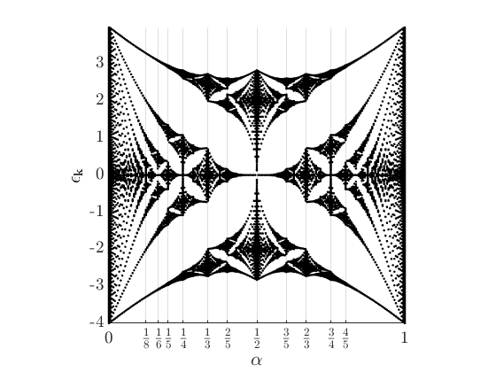

# Hofstadter's butterfly
  
# Tight binding Hamiltonian with magnetic field


The tight binding Hamiltonian with Peierls substitution can be generated with `normalMetalRectangularCell(in)`.


`in `is a structure consisting of elements:


`Nx, Ny - System lengths`


`chemPot - Chemical potential`


`hopInt - Hopping integral`


`b - Magnetic field strength scaled with `$2\pi$


`impurityArray - An array of potential impurities, major order along x`


  
## Energy spectrum of normal metals in magnetic field


Generate data (`EN200x25.mat`) of eigenvalues across different values of magnetic field `b` in a for-loop for different Hamiltonian with `testRectangular.m`.


Plotting eigenenergy against normalized magnetic field strength alpha gives us the Hofstadter's butterfly.


Plot source code:


```matlab:Code
run("hofBFPlot.m")
```




