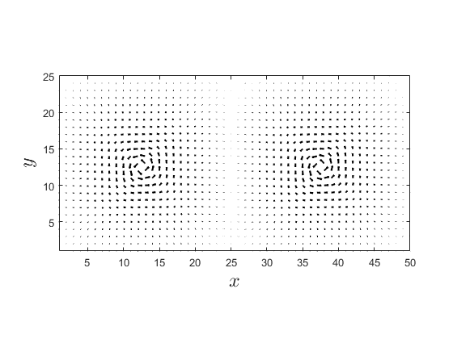

# Microscopic calculations
  


If self-consistency is achieved in the SCOP, one can use the obtained Hamiltonian to calculate many various physical properties.


# Temperature dependence


See [Self-Consistent Order Parameter](..\selfconsistency\selfconsistency.md).


# Magnetic field dependence


Using [`tDependence.m`](..\selfconsistency\tDependence.m), the critical temperature of the order parameter can be calculated. Then by manually inserting the data an a fit is done with [`criticalField(T, H0)`](./criticalField.m)`.`


`Result:`


```matlab:Code
openfig("criticalFieldRelation.fig","visible");
```

# SC Order parameter


See [Self-Consistent Order Parameter](..\selfconsistency\selfconsistency.md).


Order parameter 3D surface plot:


```matlab:Code
run('plotOrder3DSurface.m')
```


Order parameter phase angle plot:


```matlab:Code
run("plotPhaseAngle.m")
```


# Supercurrent


The superconducting order parameter can be calculated with` supercurrent(in, eigenE, eigenV)`.


`in - Struct defining the BCS Hamiltonian`


`eigenV - Unitary transformation matrix of BCS Hamiltonian`


`eigenE - Diagonalized matrix of BCS Hamiltonian `


  


`supercurrentCompute.m `can be used to collect the necessary data, i.e. variable after finding self-consistent SCOP and initialization parameters.


  


Supercurrent of SC in magnetic field:


```matlab:Code
run('supercurrentPlot.m')
```


# Free Energy


The free energy can be calculated with` freeEnergyBCS(in, eigenV, eigenE)`.


`in - Struct defining the BCS Hamiltonian`


`eigenV - Unitary transformation matrix of BCS Hamiltonian`


`eigenE - Diagonalized matrix of BCS Hamiltonian`


  


`freeEnergyCompute.m `can be used to calculate free energies of both normal metal and SC, for comparison.


  


Free energy comparison:


```matlab:Code
run('freeEnergyPlot.m')
```


```text:Output
Warning: Imaginary parts of complex X and/or Y arguments ignored.
```




