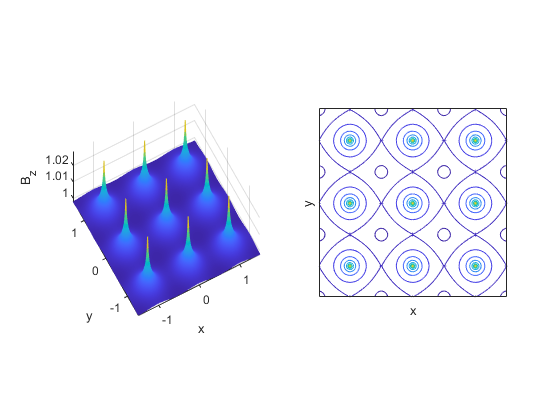
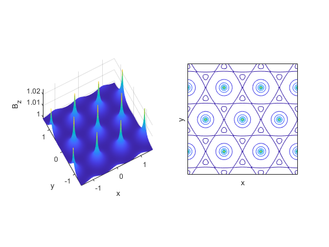
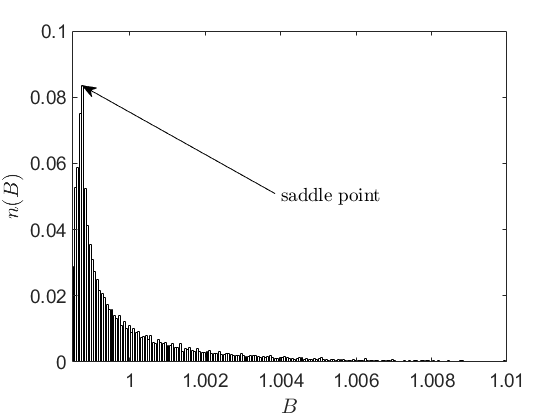
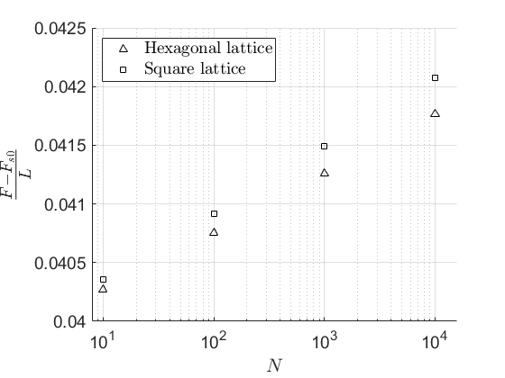
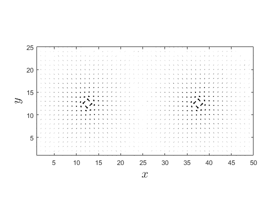

# Phenomenological calculations
  
# Flux density


Flux densities are calculated using `fluxdensitySquare(lpd, b, a, x, y)`* *and `fluxdensitySquare(lpd, b, a, x, y)`.


`lpd - London's penetration depth`


`b - Magnetic field strength`


`a - Lattice constant`


`x,y - Coordinates, can be scalar or mesh of coordinates `


  


`dataHexCode.m `and` dataSquareCode.m `is used to generate flux density data `datahex.mat` and `datasquare.mat` in hexagonal and square lattice respectively.


In the following codes, generated data were imported and plotted.


Flux density of the square lattice:


```matlab:Code
run("fluxPlotSquare.m")
```





Flux density of the hexagonal lattice:


```matlab:Code
run('fluxPlotHex.m')
```





Flux histogram of hexagonal lattice:


```matlab:Code
run('fluxPlotHistogram.m')
```


```text:Output
Warning: Class 'Annotate' uses an undocumented syntax to restrict property values. Use property validation syntax instead. This warning will become an error in a future release.
```




  
# Free energy


Free energy are calculated using `freeEnergyHex(a, b, lpd, N) `and `freeEnergySquare(a, b, lpd, N)`.


`lpd - London's penetration depth`


`b - Magnetic field strength`


`a - Lattice constant`


\texttt{N - Lattice length (for one side, i.e. size is N*N)}


  


`freeenergy.m `is used to generate struct for energy of both hexagonal and square lattice in different lattice length `N`.


Plot source code:


```matlab:Code
run("freeEnergyPlot.m")
```




# Supercurrent


Supercurrent are calculated using` currentSquare(lpd, b, a, x, y)`.


`lpd - London's penetration depth`


`b - Magnetic field strength`


`a - Lattice constant`


`x,y - Coordinates, can be scalar or mesh of coordinates `


  


`dataCurrentSquareCode.m `is used to generate flux density data `datacurrentsquare.mat` in square lattice.


Plot source code:


```matlab:Code
run('currentSquarePlot.m')
```


```text:Output
Warning: Using only the real component of complex data.
```




