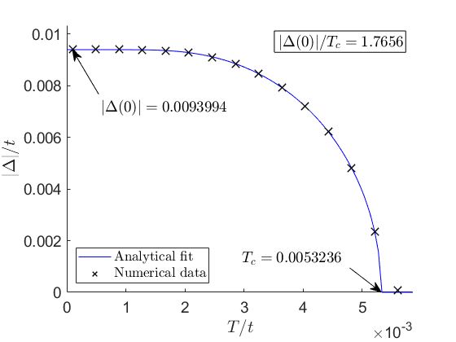
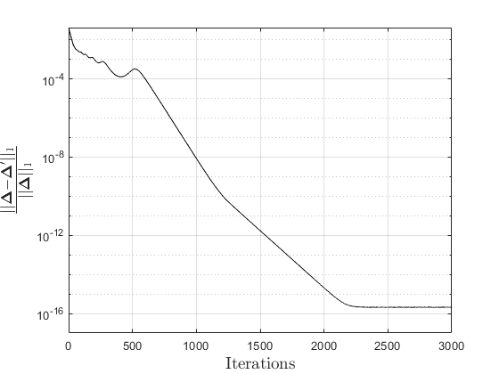
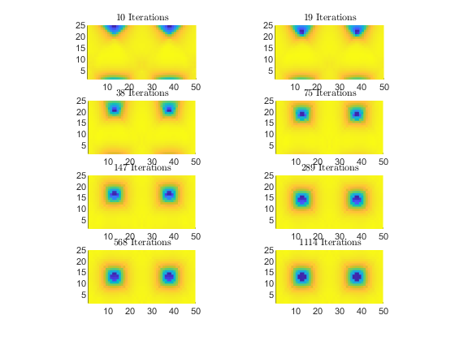
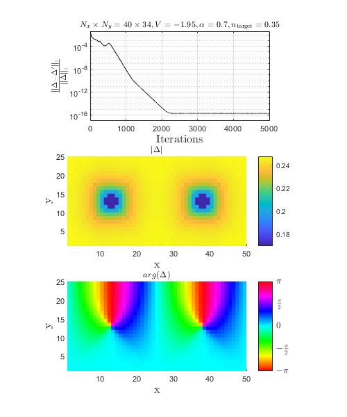

# Self-Consistent Order Parameter
  
# BCS Hamiltonian with magnetic field


The BCS Hamiltonian with Peierls substitution can be generated with [`bcsRectangularCell(in)`](https://github.com/metersquared/SCInMagField/blob/main/selfconsistency/bcsRectangularCell.m).


`in `is a structure consisting of elements:


`Nx, Ny - System lengths`


`chemPot - Chemical potential`


`hopInt - Hopping integral`


`b - Magnetic field strength scaled with `$2\pi$


`impurityArray - An array of potential impurities, major order along x`


`gapArray - An array of on-site SC order parameter, major order along x`


  
# SC Order Parameter


The superconducting order parameter can be calculated with [`calcGap(V, T, P, eigenP)`](https://github.com/metersquared/SCInMagField/blob/main/selfconsistency/calcGap.m).


`V - Attractive potential (positive value)`


`T - Temperature`


`P - Unitary transformation matrix of BCS Hamiltonian`


`eigenP - Diagonalized matrix of BCS Hamiltonian `


  
# Filling


The filling can be calculated with [`calcN(T, P, eigenP)`](https://github.com/metersquared/SCInMagField/blob/main/selfconsistency/calcN.m).


`T - Temperature`


`P - Unitary transformation matrix of BCS Hamiltonian`


`eigenP - Diagonalized matrix of BCS Hamiltonian `


  
# Calculating the self consistent SC order parameter
  
## Parameter initialization


Initialize parameters in a structure, i.e. with [`tDependencePar.m`](https://github.com/metersquared/SCInMagField/blob/main/selfconsistency/tDependencePar.m) where  `in` struct is created to a data.


## Convergence algorithm


Use [`varCalc(in, tFactor)`](https://github.com/metersquared/SCInMagField/blob/main/selfconsistency/varCalc.m) to use fixed point iteration to find self-consistent SCOP for a particular temperature `tFactor` up to a maximum iteration `in.maxIterations`.


## Examples
### Temperature dependence


One can sweep `varCalc()` over different temperature. Use `tDependencePar.m` to initialize and [`tDependence.m`](https://github.com/metersquared/SCInMagField/blob/main/selfconsistency/tDependence.m) to iterate over the defined interval of temperature.


Temperature dependence can be fitted with the theoretical gap equation through [`gapEquation(T,MaxGap,Tc)`](https://github.com/metersquared/SCInMagField/blob/main/selfconsistency/gapEquation.m) where `MaxGap` and `Tc` are the fitting parameters :


```matlab:Code
run('FitAndPlotGapT.m')
```


```text:Output
Local minimum possible.

lsqcurvefit stopped because the final change in the sum of squares relative to 
its initial value is less than the value of the function tolerance.

<stopping criteria details>
```




### Order parameter time series


For saving the history of the SCOP, we can use [`vortexEvolution(filename_in,filename_out)`](https://github.com/metersquared/SCInMagField/blob/main/selfconsistency/vortexEvolution.m). This tracks the gap parameter for 20 evenly-divided intervals of iterations from the given maximum iterations. The parameters are initialized with [`trackPar.m`](https://github.com/metersquared/SCInMagField/blob/main/selfconsistency/trackPar.m).


Different plots can be generated, i.e.


Convergence of SCOP:


```matlab:Code
run('convergencePlot.m')
```





Evolution of SCOP:


```matlab:Code
run('gapEvolutionPlot.m')
```


Order parameters and convergence of SCOP:


```matlab:Code
run('plotOrderData.m')
```







